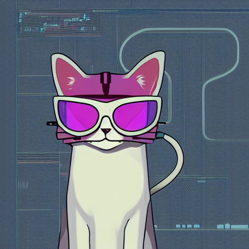

# 🧠 스테이블디퓨전을 쉽게 사용해보세요~

그림 그려주는 AI, Stable Diffusion~</br>
</br>
이 라이브러리는 말이죠~</br>
그냥 모듈 불러오고, 프롬프트 쓰고, 실행하면 끝~</br>
복잡한 거 없습니다~ 진짜로~</br>
</br>

# ✨ 설치 방법
```bash
pip install stable-easy-diffusion
```
깔고 바로 쓸 수 있어요~</br>
</br>

# 🖼️ 이미지 생성하기 예시
```bash
stable-diffusion-easy$ python main.py
torch device : cuda
스테이블 디퓨전 checkpoint : runwayml/stable-diffusion-v1-5
Loading pipeline components...: 100%|██████████████████████████████████████████████| 7/7 [00:01<00:00,  3.57it/s]
사용 프롬프트:
('a cat wearing sunglasses, in the style of cyberpunk',)

네거티브 프롬프트:
(' ',)

100%|████████████████████████████████████████████████████████████████████████████| 30/30 [00:02<00:00, 13.49it/s]
이미지 저장 완료: cool_cat_1.png
stable-diffusion-easy$
```

</br>
cool_cat_1.png

</br></br>

# 🎯 특징

- 🧩 프롬프트만 입력하면 끝~
- 📁 결과 이미지는 자동 저장~
- ⚙️ GPU만 있으면 속도도 빠름~
- 🤖 복잡한 설정? 그런 거 몰라도 돼요~

